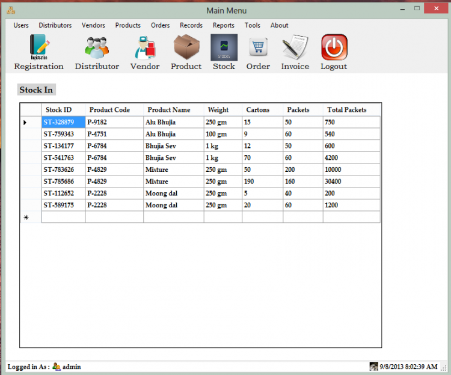

# Sales and Inventory Management System

  

## 📌 Description
This project is a **Sales and Inventory Management System** developed using **VB.NET** with **MS Access** as the backend database.

The system helps manage business operations such as product inventory, customer records, and billing efficiently.

## 🚀 Features
- Customer and Vendor Management  
- Order Processing  
- Inventory Management  
- Invoice Generation  
- Advanced Search Functionality  
- Reports Generation  

## 🛠️ Technologies Used
- VB.NET  
- MS Access Database  
- Visual Studio  

## ▶️ How to Run
1. Open the `.sln` file in Visual Studio  
2. Build the project  
3. Run the application  

## 📷 Screenshot

---

## 👩‍💻 Author
Nayana Nagaraj